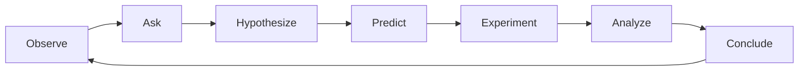

# LabClaw

**Self-evolving agentic system for research laboratories.**

LabClaw encodes the complete scientific method as an autonomous computational loop.
It accumulates persistent memory that makes it increasingly effective over time,
and serves each team member with personalized intelligence.

---

## What LabClaw Does



1. **Observe** — Watch incoming files and session events 24/7
2. **Mine** — Discover patterns and anomalies in experimental data
3. **Hypothesize** — Generate testable hypotheses with LLM + statistics
4. **Optimize** — Bayesian optimization with safety constraints and human approval
5. **Validate** — Statistical tests, cross-validation, full provenance
6. **Evolve** — Improve its own analytical strategies safely over time

## Quick Install

```bash
pip install labclaw
```

Or for development:

```bash
git clone https://github.com/labclaw/labclaw.git
cd labclaw
make dev-install
```

## Five-Layer Architecture

| Layer | Name | Purpose |
|-------|------|---------|
| 5 | Persona & Digital Staff | Human + AI members, training, promotion |
| 4 | Memory | Lab super brain (Markdown + Knowledge Graph) |
| 3 | Engine | Scientific method loop (OBSERVE → CONCLUDE) |
| 2 | Software Infra | Gateway, Event Bus, API, Dashboard, Edge Nodes |
| 1 | Hardware | Devices, interfaces, manager, safety |

[:material-arrow-right: Architecture deep dive](architecture.md){ .md-button }
[:material-rocket-launch: Quickstart](quickstart.md){ .md-button .md-button--primary }
