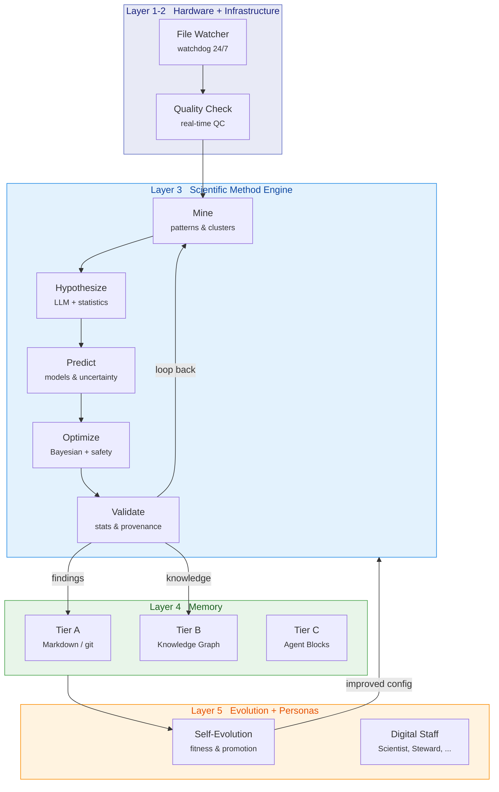
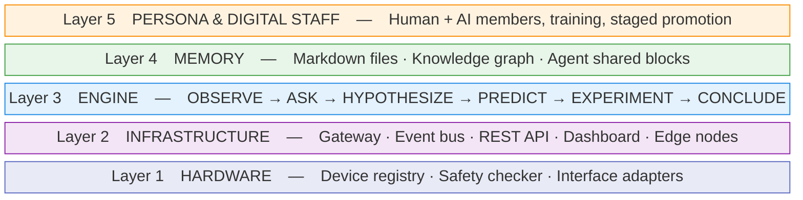

---
hide:
  - navigation
---

# LabClaw

<p style="font-size: 1.3em; color: var(--md-default-fg-color--light);">
The self-evolving brain for research laboratories.
</p>

LabClaw encodes the complete scientific method as an autonomous loop — observing
experiments, mining patterns, generating hypotheses, and improving its own
strategies over time. Every finding is traceable, every decision is auditable,
and the system gets smarter with each cycle.

[:material-rocket-launch: Quickstart](quickstart.md){ .md-button .md-button--primary }
[:material-github: GitHub](https://github.com/labclaw/labclaw){ .md-button }

---

## How It Works

LabClaw runs a continuous scientific method loop across your lab's data.
Each cycle feeds discoveries back into the next, while the evolution engine
optimizes the analytical strategies themselves.



---

## Why LabClaw

<div class="grid cards" markdown>

-   :material-microscope:{ .lg .middle } **Domain-Native**

    ---

    Built for neuroscience first: understands NWB files, pose estimation,
    calcium imaging, and electrophysiology out of the box. Plugin system
    extends to any science domain.

-   :material-brain:{ .lg .middle } **Self-Improving**

    ---

    The evolution engine measures analytical fitness, proposes strategy
    changes, tests them in staged rollouts, and automatically rolls back
    failures. The system gets better without manual tuning.

-   :material-link-variant:{ .lg .middle } **Full Provenance**

    ---

    Every finding links back to raw data, analysis parameters, statistical
    tests, and the software version that produced it. 100% reproducible,
    100% auditable.

-   :material-memory:{ .lg .middle } **Persistent Memory**

    ---

    Three-tier memory (Markdown + Knowledge Graph + Agent Blocks) means
    the lab never forgets a protocol, a failure, or a hard-won insight.
    Restart the system — 90%+ of findings are immediately retrievable.

-   :material-eye:{ .lg .middle } **24/7 Observation**

    ---

    Edge nodes watch instrument output folders around the clock. New
    recordings are ingested, quality-checked, and fed into the discovery
    pipeline automatically.

-   :material-shield-check:{ .lg .middle } **Safe by Design**

    ---

    Role-based governance, hardware safety guards, human-in-the-loop
    approval for experiments, and immutable audit logs. Digital staff
    earn trust through staged promotion, not blind access.

</div>

---

## Five-Layer Architecture



[:material-arrow-right: Architecture deep dive](architecture.md){ .md-button }

---

## Quick Install

=== "pip"

    ```bash
    pip install labclaw
    ```

=== "Development"

    ```bash
    git clone https://github.com/labclaw/labclaw.git
    cd labclaw
    make dev-install   # uv sync --extra dev --extra science
    ```

=== "Docker"

    ```bash
    docker pull ghcr.io/labclaw/labclaw:latest
    docker run -p 18800:18800 -v ./data:/data labclaw
    ```

```bash
# Start the API + discovery loop
uv run labclaw serve --data-dir ./data --memory-root ./lab

# Health check
curl http://127.0.0.1:18800/api/health
```

---

## Proven Capabilities

LabClaw demonstrates five core capabilities with reproducible benchmarks:

| Capability | What it proves | Metric |
|:-----------|:---------------|:-------|
| **C1 DISCOVER** | Real data → statistically significant finding | p < 0.05 |
| **C2 EVOLVE** | Self-improvement over 10 cycles | Fitness +15%, ablation significant |
| **C3 REMEMBER** | Persistent memory survives restart | 90%+ findings retrievable |
| **C4 TRACE** | Complete provenance for every finding | 100% chain coverage |
| **C5 REPRODUCE** | Deterministic output given same input + seed | Bit-identical results |

---

<div style="text-align: center; padding: 1em 0;">
<p style="font-size: 0.9em; color: var(--md-default-fg-color--light);">
LabClaw is developed by <a href="https://github.com/labclaw">LabClaw Team</a> and released under the Apache 2.0 license.
</p>
</div>
